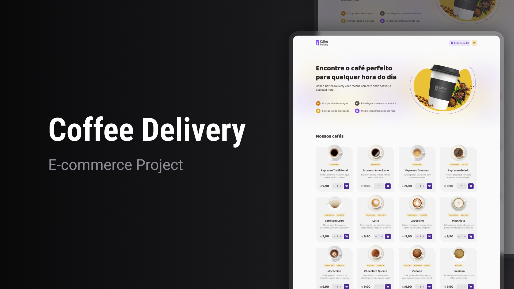

<h1 align="center">
  Coffee Delivery
</h1>




<br/>

## ☕ Coffee Shop E-commerce
Welcome to the Coffee Shop E-commerce project! This application is a fully functional e-commerce site for coffee sales, developed to strengthen and demonstrate concepts such as state management with Context API, routing with React Router, form validation with react-hook-form and zod, and styling with styled-components.

## ✨ Features
- Product Browsing: View and browse through a selection of coffee products.
- Shopping Cart: Add, remove, and adjust quantities of items in the cart.
- Checkout Form: A fully validated checkout form for secure and smooth transactions.
- Order Confirmation: See order details upon successful checkout.

## 🚀 Technologies

This project was developed with the following technologies:

- [React](https://reactjs.org)
- [TypeScript](https://www.typescriptlang.org/)
- [StyledComponents](https://www.styled-components.com/)
- [Zod](https://zod.dev/)
- [ReactHookForm](https://react-hook-form.com/)
- [ReactRouterDom](https://reactrouter.com/)
- [Immerjs](https://github.com/immerjs/immer#readme)

## 🚀 Getting Started

Prerequisites
Make sure you have the following installed:

- Node.js
- npm, pnpm or yarn

To clone and run this application, you'll need [Git](https://git-scm.com) and [Pmpm](https://pnpm.io/). From your command line:

```bash
# Clone the repository
$ git clone https://github.com/cdfortes/coffee-delivery.git

# Go into the directory
$ cd coffee-delivery

# Install dependencies
$ pnpm i

# Run the development server
$ pnpm run dev

# Navigate to http://localhost:5173/
# The app will automatically reload if you change any of the source files.

```

## 💻 Usage
- Browse through coffee products.
- Add items to your cart.
- Adjust quantities or remove items.
- Complete the checkout form to place an order.

## 🎯 Learning Objectives
- Improve understanding and implementation of Context API for state management.
- Practice React Router for page navigation in a single-page application.
- Deepen form handling skills with react-hook-form and zod for validation.
- Develop styling capabilities with styled-components for modular design.

---

Made with ♥ by Carlos Fortes👋🏻